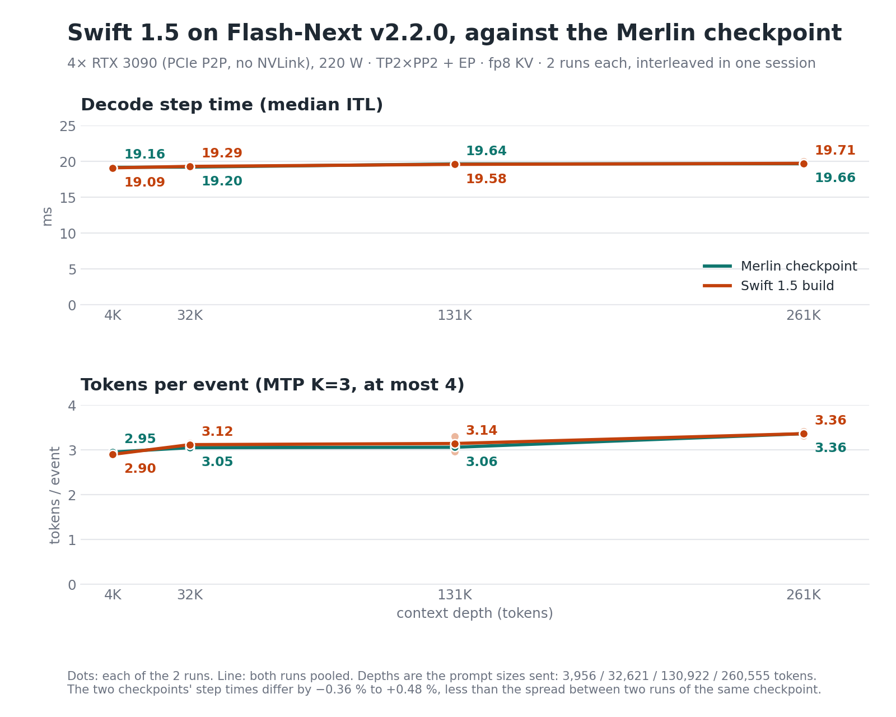

# Qwen3.8-Flash-Next · Swift 1.5 weights · W4A16 Merlin recipe

Serving instructions for a W4A16 checkpoint of UkisAI's Swift 1.5 post-train of Qwen3.8-Flash-Next
([ukisai/Swift1.5-Qwen3.8-Flash-Next](https://huggingface.co/ukisai/Swift1.5-Qwen3.8-Flash-Next/tree/0bd4fe22431372cdad1979267d3ab45aa7e6150a)),
served by the unchanged **Flash-Next v2.2.0** engine.
The checkpoint keeps the quantised routed experts, MTP head and PLE table of the Merlin checkpoint
([halt95/Qwen3.8-Flash-Next-W4A16-Merlin](https://huggingface.co/halt95/Qwen3.8-Flash-Next-W4A16-Merlin)), replaces
the 300 dense tensors our comparison identified as changed by Swift 1.5, and carries FP8 KV scales recalibrated for this checkpoint. It is published at
[halt95/Swift1.5-Qwen3.8-Flash-Next-W4A16-Merlin](https://huggingface.co/halt95/Swift1.5-Qwen3.8-Flash-Next-W4A16-Merlin).

This is an independent derivative made by halt95. It is not made, reviewed or endorsed by UkisAI or by Qwen.

## At a glance

- **The engine is unchanged.** The vLLM engine, build, serving profile and KV pool are those of the Flash-Next v2.2.0
  release ([halt95/qwen38-flash-next-3090s](https://github.com/halt95/qwen38-flash-next-3090s), tag `v2.2.0`). This
  repository does not contain the engine: `release/install-env.sh` installs it from that repository at the pinned
  commit, with that repository's own build script, and `serve/serve.sh` starts its v2.2.0 launcher with this
  checkpoint's KV-scale sidecar and the `xhigh` reasoning-effort default.
- **What changes** against serving the Merlin checkpoint: the checkpoint path, the KV-scale sidecar
  (`quant/kv_scales-swift-e4m3.json`, the default of `serve/serve.sh`; serving the Merlin checkpoint instead needs
  `SCALES=engine/scales/qsa_kv_scales_262k.json`, because Swift 1.5 changed `k_proj` / `v_proj` and the two
  checkpoints' KV scales do not carry over), and the recommended reasoning effort, `xhigh` (see
  [Reasoning effort](#reasoning-effort)).
- **Same shape, same pool.** Four RTX 3090 (24 GB), TP2 × PP2 + EP, MTP K=3, 262,144-token maximum context,
  806,792-token FP8 KV pool — identical to the Merlin checkpoint (see [Benchmarks](#benchmarks)).
- **Tokenizer is unchanged from the Merlin checkpoint's** (see [Known behaviours](#known-behaviours)).

## Quick start

See [Requirements](#requirements) first (Linux x86-64 with glibc 2.34 or newer, Python 3.13 with venv and headers,
an NVIDIA driver with CUDA 13.0 or newer, a C/C++ compiler and ninja, four 24 GB cards, 96 GB of host RAM).

```bash
git clone --branch v2.2.0-swift1.5 https://github.com/halt95/Swift1.5-qwen38-flash-next-3090s.git
cd Swift1.5-qwen38-flash-next-3090s
sha256sum -c release/SHA256SUMS                          # the repository files
# 1. the engine: Flash-Next v2.2.0 at its pinned commit, built by its own build script into ./engine
release/install-env.sh
# 2. the checkpoint, at the pinned revision
HF_HUB_DISABLE_TELEMETRY=1 engine/venv-v2.2/bin/hf download halt95/Swift1.5-Qwen3.8-Flash-Next-W4A16-Merlin \
  --revision a555a2a987d1b76f71cb1b7589e162462c6aa819 --local-dir ./ckpt
(cd ckpt && sha256sum -c ../release/checkpoint.sha256)   # the 41 checkpoint files
# 3. serve on the four cards
serve/serve.sh "$PWD/ckpt"
```

`engine/venv-v2.2/bin/hf` is the Hugging Face CLI the engine's venv already carries; a standalone `hf`
(`pipx install huggingface_hub` or `uv tool install huggingface_hub`; a system-wide `pip install` is refused on current
Debian and Ubuntu) works the same. `release/checkpoint.sha256` lists the checkpoint's files as published; the HF
checkpoint repository also ships its own `SHA256SUMS` over the same 41 files.

The server listens on `127.0.0.1:8000` and serves the model as `flash-next` (also `flash-next-v2`, `flash-mtp` and
`flash-next-mtp`):

```bash
curl -s localhost:8000/v1/chat/completions -H 'Content-Type: application/json' \
  -d '{"model":"flash-next","messages":[{"role":"user","content":"hello"}],"max_tokens":512}'
```

How to tell the server is healthy: [Check it's working](#check-its-working). Read
[Known behaviours](#known-behaviours) before putting it in front of clients.

## Quick start (container)

One image, built by the same install route as the bare-metal quick start (`release/install-env.sh` inside the image)
and serving the same command (`serve/serve.sh`). The image has been built and its entrypoint checks run on a host
without GPUs; GPU serving was verified on the bare-metal route, not yet inside the container. Host requirements:

- Linux x86-64 with four RTX 3090s (24 GB each), headless, with working peer-to-peer, and the host RAM from
  [Requirements](#requirements).
- An NVIDIA driver for CUDA 13.0 or newer.
- `nvidia-container-toolkit` registered with Docker
  (`sudo nvidia-ctk runtime configure --runtime=docker && sudo systemctl restart docker`).
- Docker Compose v2 (`docker compose`, not the 1.x `docker-compose`), for the compose route.
- About 9 GB of disk for the image and 124 GB for the checkpoint.

```bash
git clone --branch v2.2.0-swift1.5 https://github.com/halt95/Swift1.5-qwen38-flash-next-3090s.git
cd Swift1.5-qwen38-flash-next-3090s
docker build -t swift1.5-qwen38-flash-next-3090s:v2.2.0-swift1.5 .   # the release's own install route
hf download halt95/Swift1.5-Qwen3.8-Flash-Next-W4A16-Merlin \
  --revision a555a2a987d1b76f71cb1b7589e162462c6aa819 --local-dir /path/to/Swift1.5-Qwen3.8-Flash-Next-W4A16-Merlin
(cd /path/to/Swift1.5-Qwen3.8-Flash-Next-W4A16-Merlin && sha256sum -c /path/to/clone/release/checkpoint.sha256)
MODEL_DIR=/path/to/Swift1.5-Qwen3.8-Flash-Next-W4A16-Merlin docker compose up -d
docker compose logs -f flash-next      # wait for "Application startup complete" (first start compiles the graphs)
curl -s localhost:8000/v1/chat/completions -H 'Content-Type: application/json' \
  -d '{"model":"flash-next","messages":[{"role":"user","content":"hello"}],"max_tokens":512}'
```

`hf` is the Hugging Face CLI (`pipx install huggingface_hub`). The checkpoint is **mounted** at `/model`, never copied
into the image; `.dockerignore` keeps the build context to the install and serve files and the sidecar, so an engine
installed into the clone (`engine/`) or a checkpoint downloaded into it is not sent to Docker either.

Without compose:

```bash
docker run -d --name flash-next --gpus all --ipc=host --ulimit memlock=-1 --stop-timeout 70 -p 8000:8000 \
  -v /path/to/Swift1.5-Qwen3.8-Flash-Next-W4A16-Merlin:/model:ro -v swift15-flash-next-cache:/cache \
  swift1.5-qwen38-flash-next-3090s:v2.2.0-swift1.5
```

- `--ipc=host` (or `--shm-size=8g`): the parallel workers exchange data through `/dev/shm`; Docker's 64 MB default is
  too small.
- `--ulimit memlock=-1`: the host-resident tables are pinned host memory.
- `--stop-timeout 70`: the server drains for up to 60 s on shutdown; Docker's 10 s default would kill it mid-drain.
- The `/cache` volume keeps the engine's compile cache and FlashInfer's and Triton's kernels. The first start compiles
  them (17 minutes from an empty cache in our bare-metal check); later starts reuse them.
- The image sets `HF_HUB_OFFLINE=1` and the launcher turns vLLM usage statistics off, so the container neither reports
  usage nor contacts the Hugging Face Hub.

**Settings** are `serve/serve.sh`'s environment variables (see [Build and serve](#build-and-serve)), passed with `-e`
(or under `environment:` in compose): `PORT` (8000), `MODEL_NAME`, `SCALES`, `COUNTERS`, `VLLM_API_KEY` and the rest
of the launcher's knobs. Arguments after the image name go to `vllm serve`, as with `serve/serve.sh`; for a shell in
the image use `docker run --rm -it --entrypoint bash swift1.5-qwen38-flash-next-3090s:v2.2.0-swift1.5`.

The endpoint has no API key and publishes port 8000 on every interface. If the host is reachable from other machines,
set `VLLM_API_KEY` (clients then send `Authorization: Bearer <key>`), or publish `127.0.0.1:8000:8000` behind a proxy.
The image's `HEALTHCHECK` runs a one-token generation, not `/v1/models`, which keeps answering after the engine has
died: `docker inspect --format '{{.State.Health.Status}}' flash-next`.

## Build and serve

| path | what |
|---|---|
| `release/install-env.sh` | clones the Flash-Next v2.2.0 repository into `engine/` (or `ENGINE=`), checks out the pinned commit and asserts it, a clean tracked tree and the launcher's sha256; downloads the two v2.2.0 release assets (the delta bundle and the compiled-ops tarball) and verifies them against the engine's `upstream/PIN-v2.2`; then runs the engine's `scripts/build-v2.2.sh ./vllm-v2.2 ./venv-v2.2`. Every step checks its exit code; it refuses an existing `engine/` at another commit |
| `serve/serve.sh` | starts the engine's `scripts/serve-v2.2.sh` with this checkpoint's sidecar and the `xhigh` default; refuses to start unless that launcher is the published v2.2.0 file (sha256 checked) and the sidecar exists |
| `Dockerfile`, `docker-compose.yml`, `.dockerignore`, `serve/docker-entrypoint.sh` | the container route ([Quick start (container)](#quick-start-container)): the same install route inside the image, the checkpoint mounted at `/model`; built and entrypoint-checked without GPUs, not yet GPU-served in a container |
| `quant/kv_scales-swift-e4m3.json` | the static FP8 K/V scales recalibrated on this checkpoint (the same bytes as `qsa_kv_scales_swift.json` in the checkpoint) |
| `release/checkpoint.sha256` | checksums of the 41 checkpoint files |
| `release/SHA256SUMS`, `PACKAGE-MANIFEST.md` | checksums of every other file in this repository, and what each file is |
| `benchmarks/2026-09-27/` | the bench card and its chart |
| `docs/` | the repetition-loop check ([`loop-check.md`](docs/loop-check.md)) |
| `engine/` (not tracked) | created by `install-env.sh`: the v2.2.0 checkout, its built tree `vllm-v2.2/`, venv `venv-v2.2/` and, by default, the compile cache `.vllm-cache-v2.2/` |

**Serve-script variables:** the checkpoint directory is the one required argument; the rest are optional: `ENGINE`
(`<repo>/engine`), `SCALES` (`<repo>/quant/kv_scales-swift-e4m3.json`), `TREE` / `VENV` (`$ENGINE/vllm-v2.2`,
`$ENGINE/venv-v2.2`); the wrapper fills in only these, and only when they are unset. Every other knob of the v2.2.0
launcher passes through unchanged: `PORT` (8000), `HOST` (127.0.0.1),
`MODEL_NAME`, `CACHE_ROOT`, `COUNTERS` (off; `1` adds the two logging-only counters) and the rest its header lists.

`serve/serve.sh` passes `--default-chat-template-kwargs '{"enable_thinking": true, "reasoning_effort": "xhigh"}'`
after the checkpoint path. The launcher passes every argument after the checkpoint path straight through to
`vllm serve` after its own flags, so this replaces the launcher's own default (`reasoning_effort: low`) rather than
adding to it. Arguments you give `serve/serve.sh` after the checkpoint path come last, so they win in turn.
`SCALES` is resolved from the current directory (not from the install directory), and the launcher refuses to start
if the file is missing; the default is an absolute path.

The paired benchmark runs booted the published v2.2.0 launcher directly, with this sidecar (see
[Benchmarks](#benchmarks)); `serve/serve.sh` adds nothing else to its environment or command line. Separately,
the install and serve steps above were boot-tested: a fresh clone ran `release/install-env.sh`, then
`serve/serve.sh` with `SCALES` unset on the staged Hugging Face upload set (sidecar applied, 806,792-token pool,
`xhigh` default, GSM8K-200 197/200). The download step itself was not part of that test.

`HOST=0.0.0.0` exposes an endpoint without an API key on every interface: if the host is reachable from other machines,
set `VLLM_API_KEY` (or pass `--api-key` after the checkpoint; extra arguments go to `vllm serve`), or keep the default
`127.0.0.1` behind a proxy.

**Running next to a v2.2.0 install.** This repository installs its own engine copy under `engine/`; it does not
upgrade or replace a `qwen38-flash-next-3090s` install. Both serve on port 8000 by default, so stop one before
starting the other.

### Requirements

The requirements are the v2.2.0 build's, unchanged
([engine README, Build and serve](https://github.com/halt95/qwen38-flash-next-3090s#build-and-serve)):

| | Required | Reference host |
|---|---|---|
| GPUs | four visible 24 GB NVIDIA cards, headless and with no other CUDA process on them (the KV pool is pinned in bytes and leaves about 1 GB per card) | 4× RTX 3090 |
| OS | Linux x86-64 with glibc 2.34 or newer for the v2.2.0 build products (Ubuntu 22.04, Debian 12, RHEL 9 or later) | |
| NVIDIA driver | CUDA 13.0 or newer (the 580 series or later; tested on 595.84 / CUDA 13.2 and 610.43.02) | P2P-enabled |
| Python | 3.13 with venv and headers, as `python3.13` on `PATH`. Debian 13 packages it (`apt install python3.13-venv python3.13-dev`); Ubuntu 22.04 / 24.04 get it from the deadsnakes PPA (same package names); on Debian 12 or RHEL 9 use a standalone build such as `uv python install 3.13` (it ships venv and headers), or pyenv | |
| Tools | git, curl, gzip, tar, `sha256sum`; a C/C++ compiler and ninja (the first serve compiles kernels) | |
| Host RAM | 96 GB qualified; the measured resident floor is about 69 GiB | 96 GB to the serving container |
| `/dev/shm` | 1 GB or more | |
| Interconnect | qualified with peer-to-peer working on the driver; it also runs without, with lower prefill (engine README) | PCIe Gen4 x16, P2P |

**Hardware scope.** We measured only four RTX 3090 (24 GB) on PCIe Gen4 x16 with peer-to-peer enabled, a 220 W
power cap and 96 GB of host RAM (qualified allocation), with the v2.2.0 launcher's fixed profile: TP2 × PP2 + EP,
MTP K=3, 806,792-token KV pool. Configured maximum context: 262,144 tokens. Deepest prompt actually measured:
260,555 tokens (263,800-token target depth). Other GPUs, layouts, power caps and host configurations are untested.

### Check it's working

```bash
# 1. the log shows "Application startup complete" (a fresh install's first boot took 17 min in our check, because it compiles the graphs into the cache; later boots took 6–9 min)
# 2. the log's KV line reads "GPU KV cache size: 806,792 tokens" (the pool is pinned in bytes, so any other
#    number means the serve command or the build is not the shipped one)
# 3. a real generation answers (add -H "Authorization: Bearer <key>" if you set VLLM_API_KEY):
curl -s localhost:8000/v1/chat/completions -H 'Content-Type: application/json' \
  -d '{"model":"flash-next","messages":[{"role":"user","content":"ok"}],"max_tokens":16,"chat_template_kwargs":{"enable_thinking":false}}'
```

The log also names the sidecar it applied (`applied static K/V scales from .../quant/kv_scales-swift-e4m3.json`).
The first request compiles FlashInfer's kernels, so it takes noticeably longer than later ones.
Do not use `/v1/models` as a health check: it answers 200 even when the engine is dead.

### Troubleshooting

- `serve/serve.sh` refuses to start because the launcher is missing or is not the published v2.2.0 launcher: run
  `release/install-env.sh`, or point `ENGINE=` at an install it made.
- `release/install-env.sh` refuses because `engine/` exists at another commit: move it away or pass a new `ENGINE=`.
- `KV-scale sidecar missing`: `SCALES` names a file that does not exist from the current directory; give an absolute
  path or leave it unset.
- `config.json lacks text_config.ple_embedding_dtype`: this checkpoint carries that key, so the directory is not the
  full checkpoint; re-run the checksum step of the [Quick start](#quick-start).
- Empty `content` with `finish_reason: "length"`: thinking is on and `max_tokens` ended inside the reasoning, which at
  `xhigh` can be long; raise `max_tokens`, or send a lower `reasoning_effort` or `"enable_thinking": false` in
  `chat_template_kwargs`.
- Anything else at boot or while serving (`Bus error`, CUDA out-of-memory, the kernel's OOM killer, `Unsupported
  .version`, `e2-guard`): the engine is the v2.2.0 engine, unchanged; see its
  [Troubleshooting](https://github.com/halt95/qwen38-flash-next-3090s#troubleshooting).

## What is in this release

- **Engine pin:** Flash-Next v2.2.0,
  [halt95/qwen38-flash-next-3090s](https://github.com/halt95/qwen38-flash-next-3090s) tag `v2.2.0` = commit
  `cda592711239fa5061d59ef4858db4e68b217445`, launcher `scripts/serve-v2.2.sh` sha256
  `f599dac7a9861ad3358d56c14636a66c7e4bb3ce221d9804612ce41bf2d7009f`. Not copied here; installed by
  `release/install-env.sh`.
- **`serve/serve.sh`:** the v2.2.0 launcher with `SCALES` set to this checkpoint's sidecar and `xhigh` as the server
  default reasoning effort.
- **`quant/kv_scales-swift-e4m3.json`:** the KV-scale sidecar calibrated on this checkpoint.
- **Checkpoint:** [halt95/Swift1.5-Qwen3.8-Flash-Next-W4A16-Merlin](https://huggingface.co/halt95/Swift1.5-Qwen3.8-Flash-Next-W4A16-Merlin)
  (41 files, checksums in `release/checkpoint.sha256`).
- **Evidence:** the bench card (`benchmarks/2026-09-27/`) and the `xhigh` loop check
  ([docs/loop-check.md](docs/loop-check.md)).
- **Licences:** `LICENSE` (Apache-2.0), `LICENSE-SWIFT` (the Swift Open License v1.0 text), `LICENSE-QWEN` (the Qwen
  Community License 1.0 text), `NOTICE`.

Full file list: [release/PACKAGE-MANIFEST.md](release/PACKAGE-MANIFEST.md). Changes by version:
[CHANGELOG.md](CHANGELOG.md).

## Benchmarks

Four RTX 3090 (24 GB), TP2 × PP2 + EP, MTP K=3, on 2026-09-27. Both checkpoints were served by the v2.2.0
`scripts/serve-v2.2.sh` from the published v2.2.0 install, measured interleaved in one session (Merlin checkpoint,
Swift 1.5 build, Merlin checkpoint, Swift 1.5 build; a fresh boot for each run). The speed and GSM8K rows ran with
the launcher's logging counters on (`COUNTERS=1`), as v2.2.0's own numbers were measured; the `xhigh` rows ran with
no knobs set and `xhigh` as the server default.



| | Merlin checkpoint | Swift 1.5 build |
|---|---:|---:|
| Step time at approx. 4K / 32K / 131K / 261K prompt depth (ms) | 19.16 / 19.20 / 19.64 / 19.66 | 19.09 / 19.29 / 19.58 / 19.71 |
| Aggregate decode, 8 concurrent streams, relative to the Merlin checkpoint | 1.00 | 1.01 |
| MTP mean acceptance length (tokens per step, at most 4) | 2.90 | 2.92 |
| GSM8K-200, thinking off (correct of 200, two runs) | 199 / 199 | 198 / 199 |
| GSM8K-200, thinking on at `xhigh` (correct of 200) | 197 | 198 |
| GSM8K-200, thinking on, mean completion tokens at `low` / `medium` / `xhigh` (two runs each) | 262 / 296 / 416 | 259 / 284 / 304 |
| Scored retrieval of a 10-character code at ~4K / 131K / 256K prompt tokens, thinking on at `xhigh` | 3 of 3 | 3 of 3 |
| Loop check at `xhigh` (generations that collapsed into repetition, of 72) | 0 | 0 |
| KV pool (tokens) | 806,792 | 806,792 |

- Context depths are the prompt sizes actually sent: 3,956 / 32,621 / 130,922 / 260,555 tokens.
- Step time is the median interval between streamed decode events, pooled over six requests per depth (three per
  run), up to 256 generated tokens each (most ended naturally earlier). With MTP one event is one engine step and
  carries up to four tokens. Swift 1.5's step time differed from the Merlin checkpoint's by −0.36 % to +0.48 % across
  the four depths. Tokens per step differed by −1.7 % to +2.7 %; that figure depends on the generated text, which
  differs between the two checkpoints.
- Run-to-run spread of the same checkpoint was up to 1.86 % (step time) and 1.47 % (aggregate decode) between its two
  runs in this session — larger than every Swift 1.5-vs-Merlin difference above. The two are within noise.
- Aggregate decode is the mean over both runs of a 1,024-token-prompt, 512-token-output ladder at 8 concurrent streams,
  thinking off at temperature 0, shown relative to the Merlin checkpoint measured in the same session.
- MTP acceptance is 1 + 3 × (accepted draft tokens ÷ drafted draft tokens), with both counts pooled over every
  engine metrics line of both runs, from the start of each benchmark run to 10 s after its last request.
- The FP8 KV clip check passed its limits in every run. It counted a few clipped values in some runs (at most k=1 and
  v=17 against limits of 132 and 243).
- GSM8K-200 is the first 200 GSM8K test questions, 5-shot, scored by exact match on the final number. The thinking-off
  rows use temperature 0; the `xhigh` row uses the served sampling settings and allows up to 16,384 tokens (no answer
  hit that limit). The Merlin checkpoint's `xhigh` row was measured later the same day, from a fresh install made
  with this repository's `release/install-env.sh`, through `serve/serve.sh` with `SCALES` pointed at the Merlin
  sidecar. The same install served the Swift 1.5 build through `serve/serve.sh` with `SCALES` unset and scored
  197/200.
- Completion tokens by effort: the same GSM8K-200 set, thinking on, served sampling, up to 16,384 tokens, two runs per
  cell with different seeds. Accuracy was 197–198 of 200 in every cell for both checkpoints. At `xhigh` the Swift 1.5
  build used 27 % fewer completion tokens than the Merlin checkpoint (19 % after excluding one Merlin answer that hit
  the 16,384-token cap); at `low` and `medium` the two differ by less than the run-to-run spread (up to 6 %). GSM8K is
  an easy set, so reasoning effort moves its token counts only modestly; no harder set was run. Both checkpoints were
  served through this repository's `release/install-env.sh` and `serve/serve.sh`.
- Retrieval: one 10-character code placed once inside filler text, prompts sized with the server's tokenizer (4,159 /
  131,182 / 256,353 tokens for the Swift 1.5 build), thinking on at `xhigh`; the reply had to contain the code. Both
  checkpoints also passed the same smoke set: warm-prefix reuse, a tool call, a reasoning answer, four vision prompts,
  JSON-schema output and eight concurrent requests.
- The loop check is 12 long-form prompts × 6 seeds, thinking on at `xhigh`, up to 16,384 tokens (8,192 for the
  shorter prompts), 6 at a time. A generation counts as collapsed when the distinct-word-pair ratio of its last 30 % of
  words is below 0.15, or one 12-word window occurs 20 or more times. Details: [docs/loop-check.md](docs/loop-check.md).
- Single-stream decode tokens/s is not shown. With MTP on it depends on the generated text, so step time is the
  comparison we use.

The full bench card: [benchmarks/2026-09-27/BENCH-CARD.md](benchmarks/2026-09-27/BENCH-CARD.md).

### Quality

Our only quality evidence is GSM8K-200 (thinking off and at `xhigh`, for both checkpoints) and the
`xhigh` loop check. We ran no broader evaluation. UkisAI's published evaluations are of the BF16 model, not of this
quantised build.

## Known behaviours

### Tokenizer

The checkpoint serves the same `tokenizer.json` that Swift 1.5, Intel's AutoRound checkpoint and the Merlin checkpoint
ship. Its vocabulary and merges match the original Qwen file, but its pre-tokenizer pattern differs. Text with
combining marks, such as Devanagari, Thai or Arabic with diacritics, is split into more tokens than the original Qwen
file produces: 1.5 to 1.8 times as many in the three short samples we tried (Hindi, Thai and diacritised Arabic).
English, code and CJK text tokenize identically.

### Reasoning effort

The v2.2.0 launcher's server default is `low`; this repository's `serve/serve.sh` sets `xhigh` as the default.
We recommend `xhigh` for Swift 1.5. On GSM8K-200, `xhigh` cost the Swift 1.5 build 304 completion tokens per answer on average against 259 at `low`, at the same accuracy; the Merlin checkpoint's `xhigh` cost 416 (see Benchmarks). [UkisAI's model card](https://huggingface.co/ukisai/Swift1.5-Qwen3.8-Flash-Next)
reports its evaluations at `xhigh`. Our own `xhigh` evidence is the GSM8K-200 and loop-check rows in
[Benchmarks](#benchmarks).

- Per request: send `"chat_template_kwargs": {"reasoning_effort": "xhigh"}`.
- As the server default: `serve/serve.sh` already passes
  `--default-chat-template-kwargs '{"enable_thinking": true, "reasoning_effort": "xhigh"}'` after the checkpoint path.
  A request that names an effort still gets that effort.

### MTP decode speed

With MTP, single-request tokens/s depends on how much of the drafted text is accepted, and that varies with the text
being generated. Judge speed by step time, not by one request's tokens/s.

The engine's own known behaviours (architecture, vLLM 0.30) are unchanged; see the
[engine README](https://github.com/halt95/qwen38-flash-next-3090s#known-behaviours-of-the-qwen38-flash-next-architecture-in-vllm).

## How it works

**The checkpoint (Merlin recipe + Swift 1.5 dense tensors).** It starts from the Merlin checkpoint and replaces the
300 tensors that Swift 1.5 changed: the attention q/k/v/o and shared-expert projections, kept in BF16, and the GDN
`in_proj_qkv` / `in_proj_z` / `out_proj` projections, re-packed to INT8 per-channel symmetric in the Merlin
checkpoint's format. The routed experts (Intel AutoRound INT4), MTP head and FP8 PLE table are the Merlin
checkpoint's, unmodified; the FP8 KV scales were recalibrated on this checkpoint (`quant/kv_scales-swift-e4m3.json`).

**The engine (Flash-Next v2.2.0, unchanged).** vLLM 0.30.0 plus the v2.2.0 delta, served TP2 × PP2 + EP with MTP
K=3, the PLE table in host memory behind a host-mapped pull transport, the token-embedding tables in pinned host
memory, and a KV pool pinned in bytes (806,792 tokens on this hardware). The design, the KV budget and the stack are
described in the [engine README](https://github.com/halt95/qwen38-flash-next-3090s#how-it-works).

### Glossary

- **GDN**: Gated DeltaNet, the linear-attention layers that make up 36 of the model's 48 layers. The other 12 are
  full attention.
- **PLE**: the model's large n-gram embedding table. The release keeps it in FP8 and offloads it to host memory.
- **MTP K=3**: multi-token prediction. The model's own draft head proposes 3 tokens per step, and the main model
  verifies them. Acceptance length counts the tokens emitted per step, including the verified token, so it is at
  most 4.
- **TP2 × PP2 + EP**: tensor parallelism across 2 GPUs × pipeline parallelism across 2 stages (4 GPUs in total), with
  the routed experts split across GPUs (expert parallelism).
- **KV pool**: the number of tokens of FP8 KV cache the server allocates. The v2.2.0 launcher fixes its memory size,
  which gives 806,792 tokens on this hardware.
- **Sidecar**: a JSON file of static FP8 K/V scales per attention layer. The launcher reads it through `SCALES`.
- **GiB / GB**: GiB = 2^30 bytes, GB = 10^9 bytes.

## Credit

| Contribution | Source |
|---|---|
| Base model | [Qwen/Qwen3.8-Flash-Next](https://huggingface.co/Qwen/Qwen3.8-Flash-Next) |
| Swift 1.5 post-train | [ukisai/Swift1.5-Qwen3.8-Flash-Next](https://huggingface.co/ukisai/Swift1.5-Qwen3.8-Flash-Next) |
| INT4 AutoRound routed experts | [Intel/Qwen3.8-Flash-Next-W4A16-AutoRound](https://huggingface.co/Intel/Qwen3.8-Flash-Next-W4A16-AutoRound) |
| FP8 PLE table | [RadixArk/Qwen3.8-Flash-Next-NVFP4](https://huggingface.co/RadixArk/Qwen3.8-Flash-Next-NVFP4) (table only) |
| Merlin checkpoint and quantisation recipe (INT8 GDN pack, INT4 MTP pack) | [halt95/Qwen3.8-Flash-Next-W4A16-Merlin](https://huggingface.co/halt95/Qwen3.8-Flash-Next-W4A16-Merlin) |
| MTP INT4 packing recipe (adapted in the Merlin checkpoint) | DominikBucko |
| Serving engine | [vLLM](https://github.com/vllm-project/vllm) (Apache-2.0), through the unchanged Flash-Next v2.2.0 release ([halt95/qwen38-flash-next-3090s](https://github.com/halt95/qwen38-flash-next-3090s)), installed by `release/install-env.sh` |

Third-party notices are in [NOTICE](NOTICE).

## Licence

- **Code** in this repository — the scripts (`serve/`, `release/`) and the documentation — is under Apache-2.0
  (`LICENSE`). The engine is not part of this repository: `release/install-env.sh` installs it from
  [halt95/qwen38-flash-next-3090s](https://github.com/halt95/qwen38-flash-next-3090s), a vLLM fork under Apache-2.0
  whose own `NOTICE` lists the modified files.
- **The Swift 1.5 KV-scale sidecar** (`quant/kv_scales-swift-e4m3.json`) is model-derived data, not under
  Apache-2.0. See `NOTICE`. It is subject to the Swift Open License v1.0 (`LICENSE-SWIFT`) and the Qwen Community
  License 1.0 (`LICENSE-QWEN`).
- **The checkpoint you serve**
  ([halt95/Swift1.5-Qwen3.8-Flash-Next-W4A16-Merlin](https://huggingface.co/halt95/Swift1.5-Qwen3.8-Flash-Next-W4A16-Merlin))
  is subject to the same two licences; it is not part of this repository.
  - Commercial Use by a Legal Entity whose gross revenue meets or exceeds US$1,000,000 is not licensed under the
    Swift Open License. Revenue is measured over the most recently completed fiscal year across that entity and all
    entities controlling, controlled by, or under common control with it. A Qualified Non-Profit Organization's
    Non-Commercial or Research Purposes are exempt from the threshold. An entity above the threshold may obtain a
    separate written Swift Enterprise License from UkisAI. See Swift Open License §§1 and 5.
  - If the Software or a derivative is used for a licensee's commercial product or service with more than
    100,000,000 monthly active users or more than US$20,000,000 monthly revenue, the respective model name must be
    prominently displayed in that product's or service's user interface. If the licensee or an affiliate conducts a
    Model as a Service or AI Work Assistant business, it must obtain a separate Qwen licence before any commercial
    use, except for qualifying internal use that makes neither the software, its outputs, nor its model capabilities
    available to a third party. See Qwen Community License §§1–2.
- "UkisAI" and "Swift" are UkisAI's names. They are used here only to describe where the weights come from.
- This section summarises the licences. It is not legal advice, and the licence texts govern.

This is an independent derivative made by halt95. It is not made, reviewed or endorsed by UkisAI or by Qwen.
