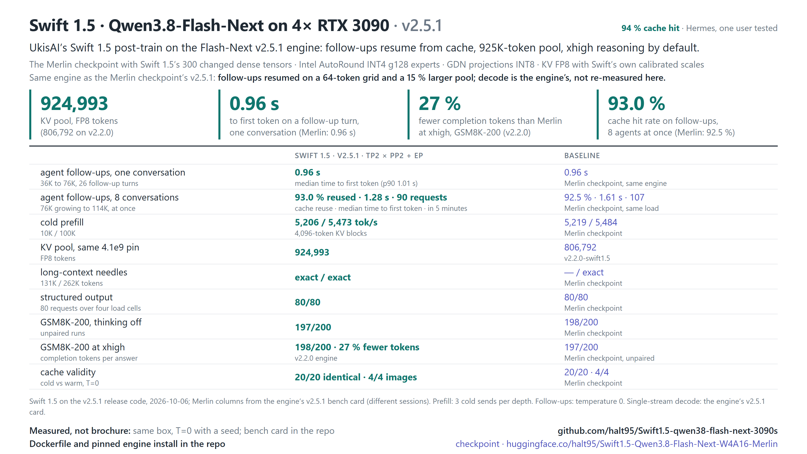

# Swift 1.5 · Qwen3.8-Flash-Next on 4× RTX 3090

**Serve UkisAI's Swift 1.5 post-train of Qwen3.8-Flash-Next at its full 262K context on four RTX 3090s, with vision,
tool calls and fast agent follow-ups, behind one OpenAI-compatible endpoint.**

[](docs/reference.md#hardware)
[](docs/reference.md#the-kv-budget)
[](docs/reference.md#the-kv-budget)
[](https://github.com/halt95/qwen38-flash-next-3090s)
[](docs/reference.md#stack)
[](https://huggingface.co/halt95/Swift1.5-Qwen3.8-Flash-Next-W4A16-Merlin)



This repository serves
[halt95/Swift1.5-Qwen3.8-Flash-Next-W4A16-Merlin](https://huggingface.co/halt95/Swift1.5-Qwen3.8-Flash-Next-W4A16-Merlin),
a 4-bit build of [UkisAI's Swift 1.5](https://huggingface.co/ukisai/Swift1.5-Qwen3.8-Flash-Next) post-train of
Qwen3.8-Flash-Next (125B MoE): the [Merlin checkpoint](https://huggingface.co/halt95/Qwen3.8-Flash-Next-W4A16-Merlin)
with the 300 dense tensors Swift 1.5 changed swapped in. It does not copy the engine: `release/install-env.sh`
installs the unchanged Flash-Next v2.5.1 engine
([halt95/qwen38-flash-next-3090s](https://github.com/halt95/qwen38-flash-next-3090s)) at its pinned commit, and
`serve/serve.sh` starts it with this checkpoint's KV scales and `xhigh` reasoning by default. The whole KV cache stays
in VRAM. The current release is **v2.5.1-swift1.5**.

This is an independent derivative made by halt95. It is not made, reviewed or endorsed by UkisAI or by Qwen.

## Why use it

- **Swift 1.5 at the Merlin checkpoint's speed.** On v2.2.0 the two stepped at the same speed within run-to-run noise,
  and at `xhigh` Swift 1.5 scored GSM8K-200 198/200 against the Merlin checkpoint's 197 (unpaired runs) with 27 % fewer
  completion tokens (19 % without one Merlin answer that hit the token cap).
- **Long context that actually fits.** A 924,993-token FP8 KV pool, measured on this checkpoint; the 131K and 262K
  needles were found exactly.
- **Built for agents.** Follow-up turns resume from cache: in one conversation the next turn starts in **0.96 s**; with
  8 agents at once, 93.0 % of follow-up tokens come from cache and the median follow-up starts in 1.28 s.
- **Fast.** 5,206–5,473 tok/s prefill from 10K to 100K tokens; decode is the engine's (its v2.5.1 bench card), not
  re-measured on this checkpoint.
- **Quality kept.** GSM8K 197/200 (thinking off), structured output 80/80, cache hits valid on 20/20 prompt pairs;
  `xhigh` reasoning by default, as UkisAI's own evaluations use.
- **Vision and tools.** Up to 42 images per request, Qwen3 tool calling and reasoning parsers.
- **Reproducible.** The install checks out the engine's pinned commit and launcher, and hash-checks every release asset,
  build product and checkpoint file before it serves.

## What you need

- 4× RTX 3090 (24 GB, sm_86), headless, with no other CUDA process on them. PCIe peer-to-peer is recommended (it also
  runs without, with slower prefill); no NVLink needed.
- 96 GB of host RAM (the model's n-gram embedding table lives there; about 69 GiB is the hard floor), `/dev/shm` of at
  least 1 GB, and about 250 GB of free disk (the checkpoint is 115 GiB).
- Linux x86-64 with glibc 2.34 or newer, an NVIDIA driver with CUDA 13.0 or newer (the 580 series or later), Python
  3.13 with venv and headers, a C/C++ compiler, ninja, git and curl. The build installs its own CUDA 13.0 toolchain
  into the venv.

Where to get Python 3.13 on Debian 12 and Ubuntu, and the rest of the detail:
[Requirements](docs/reference.md#build-and-serve).

## Quick start

```bash
git clone --branch v2.5.1-swift1.5 https://github.com/halt95/Swift1.5-qwen38-flash-next-3090s.git
cd Swift1.5-qwen38-flash-next-3090s && sha256sum -c release/SHA256SUMS
release/install-env.sh                     # the Flash-Next v2.5.1 engine, pinned and hash-checked, into ./engine
engine/venv-v2.5/bin/hf download halt95/Swift1.5-Qwen3.8-Flash-Next-W4A16-Merlin \
  --revision 3c9a1159eac1282463b06313de7dd9262edf8b58 --local-dir ./ckpt                     # 115 GiB
(cd ckpt && sha256sum -c ../release/checkpoint.sha256)   # the 41 checkpoint files

serve/serve.sh "$PWD/ckpt"
```

`hf` is the Hugging Face CLI (the engine's venv carries it; or `pipx install huggingface_hub`). Startup takes about 5–6
minutes the first time (it compiles kernels) and about 2–3 minutes after. The server is ready when the log shows
`Application startup complete` and `GPU KV cache size: 924,993 tokens`. It listens on `127.0.0.1:8000`;
`HOST=0.0.0.0` opens it to the network, and then set `VLLM_API_KEY` as well. More checks:
[Check it's working](docs/reference.md#check-its-working); if something goes wrong:
[Troubleshooting](docs/reference.md#troubleshooting).

### Container

```bash
docker build -t swift1.5-qwen38-flash-next-3090s:v2.5.1-swift1.5 .   # in the clone; runs release/install-env.sh
MODEL_DIR=/path/to/Swift1.5-Qwen3.8-Flash-Next-W4A16-Merlin docker compose up -d && docker compose logs -f flash-next
```

Run it in the clone, with the checkpoint downloaded as above (outside the clone). Needs `nvidia-container-toolkit` and
Docker Compose v2. The image has not been rebuilt or GPU-served on v2.5.1; the bare-metal route above is the verified
one. Details: [Container](docs/reference.md#container).

## Talk to it

Any OpenAI-compatible client works. With curl:

```bash
curl http://127.0.0.1:8000/v1/chat/completions -H 'Content-Type: application/json' \
  -d '{"model": "flash-next", "messages": [{"role": "user", "content": "Hello!"}]}'
```

Or from Python with the `openai` package (set `OPENAI_API_KEY` to your `VLLM_API_KEY`, or to any value if you set none):

```python
from openai import OpenAI
client = OpenAI(base_url="http://127.0.0.1:8000/v1")
reply = client.chat.completions.create(model="flash-next", messages=[{"role": "user", "content": "Hello!"}])
print(reply.choices[0].message.content)
```

- Thinking is on by default, at `xhigh` reasoning effort. A short `max_tokens` can end inside the reasoning with empty
  `content`; send `"chat_template_kwargs": {"reasoning_effort": "low"}` for a lighter effort, or
  `{"enable_thinking": false}` to turn it off for a request.
- Tools use the standard `tools` field; images go in `image_url` content parts, up to 42 per request.
- If a reply comes back empty with `finish_reason: "stop"` and zero tokens, retry once.

## What's new in v2.5.1-swift1.5

The engine moves from Flash-Next v2.2.0 to v2.5.1; the weights are unchanged, so this is everything since
v2.2.0-swift1.5.

- Agent follow-up turns resume from cache on a 64-token grid, and a conversation's cached prefix is kept until its
  next turn: a follow-up starts in 0.96 s, and with 8 deep conversations 93.0 % of follow-up tokens come from cache.
- The KV pool grows from 806,792 to 924,993 tokens (+15 %) on the same weights.
- Cold prefill runs at 5,206–5,473 tok/s (10K–100K tokens). Against v2.2.0 the engine measures prefill 1.0–2.8 %
  faster and single-stream decode about 3 % slower, on the Merlin checkpoint (not re-measured on this one).
- Combining marks tokenize as intended (transformers 5.18.0), and a prompt can carry up to 42 images.

Full patch notes, with every measurement: [CHANGELOG.md](CHANGELOG.md).

## Documentation

- [CHANGELOG.md](CHANGELOG.md): release notes, newest first.
- [docs/reference.md](docs/reference.md): what the install and serve scripts do, environment variables, container
  detail, troubleshooting, how the model sits on the four cards, capacity, known behaviours and how it is measured.
- Bench cards: [v2.5.1-swift1.5](benchmarks/2026-10-06/BENCH-CARD.md),
  [v2.2.0-swift1.5](benchmarks/2026-09-27/BENCH-CARD.md).
- [docs/loop-check.md](docs/loop-check.md): the repetition-loop check at `xhigh`.
- The engine's own documentation: [halt95/qwen38-flash-next-3090s](https://github.com/halt95/qwen38-flash-next-3090s).

## Known limitations

- Only if you shrink the KV pool yourself: keep it larger than `--max-model-len` plus a few blocks. With the shipped
  settings (a 924,993-token pool, requests up to 262,144 tokens) this cannot occur.
- With 8 long agent sessions and a nearly full pool, a few follow-ups (3 of 82 in 5 minutes) still re-read their whole
  conversation.
- Beyond the release checks above, our quality evidence is GSM8K-200 and a repetition-loop check at `xhigh`;
  UkisAI's published evaluations are of the BF16 model, not of this quantised build.
- Tested on one setup: 4× RTX 3090 at 220 W, PCIe Gen4 x16, with peer-to-peer.

The full list, with causes and mitigations: [Known behaviours](docs/reference.md#known-behaviours-of-the-qwen38-flash-next-architecture-in-vllm).

## Credits

Qwen ([Qwen3.8-Flash-Next](https://huggingface.co/Qwen/Qwen3.8-Flash-Next)), UkisAI
([Swift 1.5](https://huggingface.co/ukisai/Swift1.5-Qwen3.8-Flash-Next)), Intel
([AutoRound INT4 experts](https://huggingface.co/Intel/Qwen3.8-Flash-Next-W4A16-AutoRound)), RadixArk
([FP8 PLE table](https://huggingface.co/RadixArk/Qwen3.8-Flash-Next-NVFP4)), DominikBucko
([MTP INT4 packing recipe](https://github.com/DominikBucko/qwen38-flash-next-2x3090)), and the Flash-Next engine
([halt95/qwen38-flash-next-3090s](https://github.com/halt95/qwen38-flash-next-3090s)) on
[vLLM](https://github.com/vllm-project/vllm). Upstream vLLM fixes in the engine are credited by PR number in its
commit messages and by author in its `NOTICE`; this checkpoint's sources are in `NOTICE` and in
[the full credit list](docs/reference.md#credit).

## License

Code in this repository (the scripts in `serve/` and `release/`, and the documentation): Apache-2.0 (`LICENSE`); the
engine is not part of this repository and carries its own licence and `NOTICE`. The KV-scale sidecar
(`quant/kv_scales-swift-e4m3.json`) and the checkpoint you serve are subject to the Swift Open License v1.0
(`LICENSE-SWIFT`) and the Qwen Community License 1.0 (`LICENSE-QWEN`). Two terms to know before commercial use:

- Swift Open License: Commercial Use by a Legal Entity with US$1,000,000 or more in gross revenue (most recent fiscal
  year, with its affiliates) is not licensed; a Qualified Non-Profit Organization's Non-Commercial or Research Purposes
  are exempt, and UkisAI offers a separate Swift Enterprise License (§§1 and 5).
- Qwen Community License: a product or service with more than 100,000,000 monthly active users or more than
  US$20,000,000 monthly revenue must display the model name prominently; a Model as a Service or AI Work Assistant
  business needs a separate Qwen licence before commercial use, with a narrow internal-use exception (§§1–2).

The full summary is in [docs/reference.md](docs/reference.md#licence-detail). It is not legal advice; the licence texts
govern. "UkisAI" and "Swift" are UkisAI's names, used here only to describe where the weights come from.
